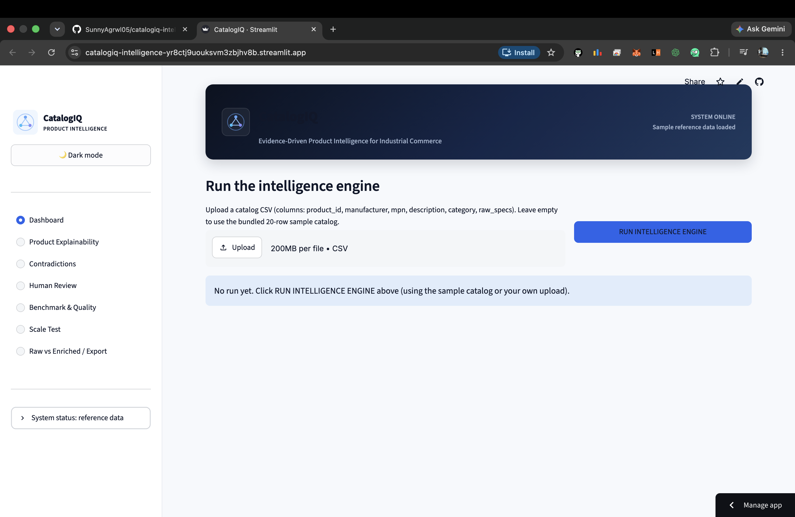

🧠 CatalogIQ Intelligence

### Evidence-Driven Product Intelligence for Industrial Commerce

Built by **Team UniCode** · UniHack Hackathon 2026

[](#)
[](https://github.com/SunnyAgrwl05/catalogiq-intelligence)

CatalogIQ turns incomplete, messy industrial product data into structured, validated, commerce-ready product intelligence. Every important output is backed by **visible evidence**, a **deterministic confidence score**, and a clear decision: `AUTO_APPROVE`, `REVIEW`, or `INVESTIGATE`.

---

## ⚠️ Data Provenance

This repository ships with small **synthetic/sample data**, not the official UniHack benchmark files.

| File | Purpose |
|---|---|
| `data/sample_input.csv` | 20 intentionally messy sample product rows |
| `data/sample_ground_truth.csv` | Expected values for the bundled sample |
| `data/synthetic_scale_1000.csv` | 1,000-row throughput demonstration |
| `data/manufacturer_brand_master.csv` | Sample manufacturer/brand reference data |
| `data/lov_master.csv` | Sample list-of-values reference data |
| `data/uom_standards.csv` | Sample unit-of-measure standards |

> No official benchmark results are claimed here.

---

## Demo



---

## Problem

Industrial product information is often fragmented, incomplete, inconsistent, and difficult to validate at catalog scale.

CatalogIQ answers:

- What manufacturer is this product associated with?
- What brand and category are most likely?
- What evidence supports that decision?
- Are the available signals consistent or contradictory?
- Should the result be automatically approved or sent for human review?

---

## Solution

1. Normalize raw product fields and placeholders
2. Resolve manufacturer, brand, and MPN
3. Gather multiple evidence signals
4. Fuse evidence while detecting contradictions
5. Validate against LOV, UOM, and anomaly rules
6. Calculate deterministic field-level confidence
7. Route to `AUTO_APPROVED`, `REVIEW_REQUIRED`, or `INVESTIGATE`
8. Export enriched, explainable product intelligence

---

## Key Innovations

| Innovation | Description |
|---|---|
| **Evidence Graph** | Every field result contains structured supporting evidence |
| **Contradiction Engine** | Detects genuine conflicts instead of averaging them away |
| **Field-Level Trust** | Confidence and decisions are calculated independently per field |
| **Human-in-the-Loop** | Non-auto-approved fields are surfaced for review |
| **Correction Memory** | Human corrections can become future evidence for matching products |
| **Live Benchmarking** | Evaluation is computed from the available ground-truth file |

---

## Architecture

```
RAW PRODUCT
    ↓
preprocessing
    ↓
entity resolution
    ↓
evidence gathering
    ↓
correction memory
    ↓
contradiction detection
    ↓
validation
    ↓
confidence scoring
    ↓
decision routing
    ↓
EXPLAINABLE / REVIEWABLE / EXPORTABLE OUTPUT
```

---

## Project Structure

```
catalogiq-intelligence/
├── app.py
├── requirements.txt
├── data/
├── pipeline/
│   ├── schemas.py
│   ├── reference_data.py
│   ├── preprocessing.py
│   ├── entity_resolution.py
│   ├── evidence.py
│   ├── contradiction.py
│   ├── confidence.py
│   ├── validation.py
│   ├── correction_memory.py
│   ├── enrichment.py
│   └── icons.py
├── evaluation/
│   └── scorer.py
└── tests/
```

---

## Evidence Graph

A field result contains the selected value, confidence, supporting evidence, validation information, and decision.

```json
{
  "field": "manufacturer",
  "value": "Moen Incorporated",
  "confidence": 0.9831,
  "decision": "AUTO_APPROVED",
  "is_conflict": false
}
```

The app exposes this information in **Product Explainability** so reviewers can understand why a value was selected.

---

## Human Review & Correction Memory

The **Human Review** section supports:

- ✅ Accept
- ✏️ Correct
- ❓ Mark Unknown

Corrections are stored in a transparent lookup table keyed by field, normalized MPN, and input manufacturer. This is **correction memory**, not a trained ML model.

---

## Validation

CatalogIQ includes:

- LOV allowed-value checks
- UOM normalization and formatting
- Placeholder detection
- Contextual anomaly checks

Unsupported values can be routed for review instead of being fabricated.

---

## Evaluation

The bundled sample currently reports:

| Metric | Result |
|---|---|
| Overall field accuracy | 96.7% (58/60) |
| Manufacturer accuracy | 95.0% (19/20) |
| Brand accuracy | 95.0% (19/20) |
| Category accuracy | 100.0% (20/20) |

> These figures are for the bundled 20-item sample only, not official UniHack benchmark results.

---

## Scalability

The bundled 1,000-row synthetic file is a throughput demonstration.

**Measured locally:** ~1,000 products in ~0.26 seconds (~3,800 products/sec)

> This is a single-process development-environment measurement, not a production SLA.

---

## Tech Stack

`Python 3.12` · `Streamlit` · `pandas` · Python standard library · `csv` · `difflib` · `dataclasses`

---

## Running Locally

```bash
git clone https://github.com/SunnyAgrwl05/catalogiq-intelligence.git
cd catalogiq-intelligence
python3 -m venv venv
source venv/bin/activate
pip install -r requirements.txt
streamlit run app.py
```

Open the local URL printed by Streamlit, typically `http://localhost:8501`.

---

## Demo Flow

1. **Dashboard** → click `RUN INTELLIGENCE ENGINE`
2. **Product Explainability** → inspect the evidence graph
3. **Contradictions** → inspect conflicting signals
4. **Human Review** → review or correct a field
5. **Benchmark & Quality** → run the live benchmark
6. **Scale Test** → run the 1,000-row throughput test
7. **Raw vs Enriched / Export** → compare and export the enriched catalog

---

## Tests

```bash
python -m unittest discover -s tests -v
```

The tests cover normalization, placeholders, measurement extraction, entity resolution, contradiction detection, confidence scoring, validation, and correction memory.

---

## Limitations

- Bundled reference and ground-truth data are synthetic/sample data
- Category does not currently use a fully trained independent classifier
- Live manufacturer-site sourcing is not enabled in the bundled pipeline
- `difflib` is suitable for the current small reference set but may need a more scalable matcher for large catalogs
- The scale result is a local single-process measurement

---

## Future Scope

- [ ] Verified manufacturer/source-discovery evidence
- [ ] Stronger category classification
- [ ] Scalable fuzzy matching for large reference masters
- [ ] Batch/multiprocessing workers
- [ ] Expanded validation and measurement rules
- [ ] Official benchmark integration when available

---

<div align="center">

**CatalogIQ**

Built with ❤️ by **Sunny Kumar** & **Team UniCode** · UniHack Hackathon 2026

</div>

